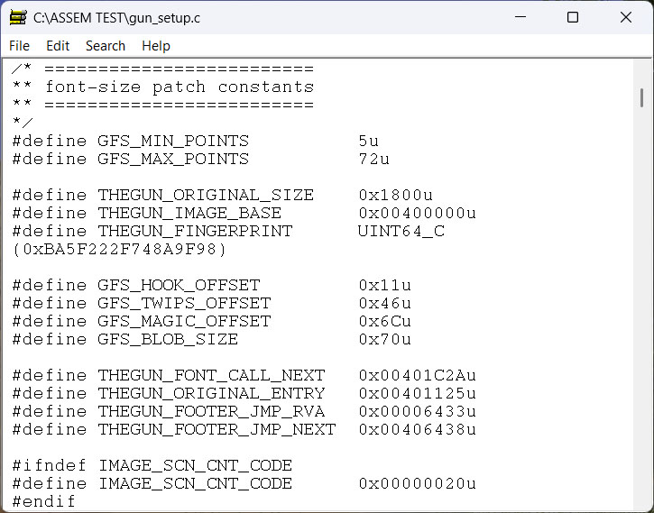
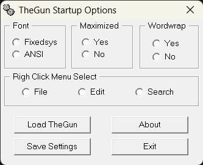

## TheGun-by-Steve-Hutchesson

TheGun by Steve Hutchesson. This gem can be hard to find.

This is version `3.0f` of TheGun. SetGun is included.  There is no known copy of the source code.

        

<b>Per Steve Hutchesson</b>

From the archive of `http://www.movsd.com/thegun.htm`:

Number One Son

TheGun.Exe 3.0f

21st Century Missile Ware

Version 3.0f has had minor internal changes and has taken advantage of the technology of a new linker written by Pelle Orinius to bring it down to its preferred size of 6k (6144 bytes). TheGun from its origin was designed to be useful within the boundaries of minimum size, high speed performance and no useless features. Its original purpose was to dump results from a compiler or an assembler build into for display which demanded near instant load.

TheGun does not use any additional runtime DLLs and is coded in Microsoft Assembler (MASM) using the Windows API functions.. It does not use or write to the registry at all and will run on Windows versions from Win95b upwards. In common with the last version, it uses a very high speed dispatcher internally for system message processing, it now tests for read only files and handles the XP style of file dialog correctly. It uses an extended version of the system "MessageBox" to display various forms of information.

For 6k in file size, it is fully drag and drop enabled, it supports wordwrap and it has a seperate accessory to change some of the startup settings. The accessory is SETGUN.EXE `(new: gun_setup.exe)` and it patches the settings directly into the disk file so there is no need for an INI file or a registry setting. It has a system defined text search capacity where you can search for text with the options of case sensitive, insensitive or search for whole words only. There is "right click" support for the menu options built into TheGun. You can quickly exit TheGun by pressing the ESC key.

TheGun does not have an effective file size limit and the maximum size that can be loaded into it is determined by available memory and loading speed of the file. It can typically load files in excess of 10 megabytes with no problems. It has been speed optimised for both file load and save.

Printing is a low priority issue with a text editor of this type and the capacity it has is farmed out to the system file Wordpad.Exe. The margin settings are those that are set in Wordpad.

TheGun still maintains its size and speed advantage over the system Notepad.Exe so if these are issues that, Number One Son will do the job for you "just fine".
