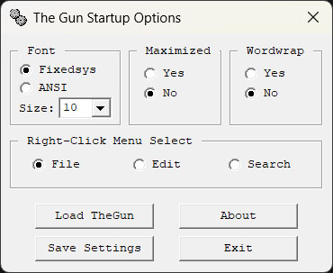

## TheGun-by-Steve-Hutchesson

TheGun by Steve Hutchesson. This gem can be hard to find.
Here, it features a new setup utility that allows font-size
changing.

 There was one thing I wanted to address with TheGun for my
own personal use: the fonts were too small. I'd already
experimented much in
[Dave's Tiny Editor](https://github.com/mpower-codeworks/Daves-Tiny-Editor)
with fonts, and figured similar could be done here. The whole idea for
`DTE` to have a setup utility came from TheGun anyway.

  

This is version `3.0f` of Steve's TheGun, unchanged. The new setup utility
only adds something TheGun already had, because it uses RICHEDIT.

  

I'm not going to include the source code for the setup utility because
it's not important. The point is to make TheGun more available (most download
links are broken or dubious) and update the fonts for modern larger screens.

Yes, I added a space in `The Gun` in the setup utility. I just felt like it.
